# MCM HOUSE POPUP (WEB) - FE

<p align="center">
  <a href="https://mcm-house-popup.vercel.app/">
    
  </a>
</p>


---

## 🔄 01. User Flow

MCM의 네 가지 HOUSE 유형을 기반으로 개인의 취향을 발견하고, 오프라인 공간 탐험까지 연결하는 모바일 웹 서비스입니다.

```mermaid
%%{init: {
  'theme': 'base',
  'themeVariables': {
    'fontFamily': '-apple-system, BlinkMacSystemFont, "Apple SD Gothic Neo", Pretendard, sans-serif',
    'fontSize': '14px',
    'lineColor': '#111111',
    'curve': 'linear'
  }
}}%%
flowchart LR
    %% Phase 1: ONLINE DISCOVERY
    subgraph P1 ["<b>PHASE 01 · ONLINE DISCOVERY</b>"]
        direction LR
        A(["<b>HOUSE TEST</b><br/>취향 문항 응답"]) --> B{"<b>A/B STYLE CHOICE</b><br/>상위 HOUSE 선호 선택"}
        B --> C["<b>HOUSE RESULT</b><br/>YOUR ROUTE 순서 생성"]
    end

    %% Phase 2: SPACE & AI EXPERIENCE
    subgraph P2 ["<b>PHASE 02 · SPACE & AI EXPERIENCE</b>"]
        direction LR
        D["<b>1F · 2F EXPLORE MAP</b><br/>추천 동선 기반 탐험"] --> E{"<b>미션 촬영</b><br/>제품 실착 & 웹 카메라"}
        E --> F["<b>AI STYLE DISCOVERY</b><br/>스타일 무드 키워드 도출"]
    end

    %% Phase 3: ARCHIVE & COMMERCE
    subgraph P3 ["<b>PHASE 03 · ARCHIVE & COMMERCE</b>"]
        direction LR
        G["<b>MY PASSPORT</b><br/>스탬프 & 타임라인 기록"] --> H["<b>제품 상세</b><br/>COMPLETE THE LOOK"]
        H --> I1(["<b>셀러 1:1 상담 접수</b>"])
        H --> I2(["<b>공식 스토어 이동</b>"])
    end

    %% Clean Linear Streamline
    C --> D
    F --> G

    %% Clear Node Style Hierarchy
    classDef default fill:#EEEEEC,stroke:#444442,stroke-width:1px,color:#111111,rx:8px,ry:8px;
    classDef highlight fill:#111111,stroke:#111111,color:#FFFFFF,rx:8px,ry:8px;
    classDef branch fill:#FFFFFF,stroke:#111111,stroke-width:1.5px,color:#111111;
    classDef action fill:#111111,stroke:#111111,color:#FFFFFF,rx:20px,ry:20px;
    classDef startPill fill:#EEEEEC,stroke:#444442,stroke-width:1px,color:#111111,rx:20px,ry:20px;

    class A startPill;
    class C,F highlight;
    class B,E branch;
    class I1,I2 action;

    style P1 fill:#FAFAFA,stroke:#EEEEEC,stroke-width:1.5px,rx:12px,ry:12px;
    style P2 fill:#FAFAFA,stroke:#EEEEEC,stroke-width:1.5px,rx:12px,ry:12px;
    style P3 fill:#FAFAFA,stroke:#EEEEEC,stroke-width:1.5px,rx:14px,ry:14px;
```



---

## ⚡ 02. Engineering Focus

#### 1. 비동기 AI 응답 처리 및 로딩 상태 제어
> AI 분석 응답 지연에 대응한 로딩 상태 및 요청 타임아웃 처리

* `AbortController`를 활용해 AI 분석 요청이 30초를 초과할 경우 요청을 중단하고 에러 상태 처리
* API 응답과 3단계 로딩 애니메이션의 완료 시점을 동기화해 자연스럽게 결과 화면으로 전환

#### 2. 모바일 웹 카메라 촬영 및 이미지 전달
> 별도 앱 이동 없이 미션 수행부터 AI 분석까지 이어지는 촬영 플로우 구현

* `MediaDevices.getUserMedia` API를 활용해 모바일 웹에서 카메라를 직접 실행하는 뷰파인더 구현
* Canvas API로 촬영 화면을 JPEG 이미지 데이터로 변환해 Style Discovery 분석 API에 전달

#### 3. 진행 상태 복구 및 유효성 검증
> 테스트 결과 식별자 유지와 잘못된 API 요청 방지를 위한 상태 검증

* URL에 `resultId`가 없을 경우 `localStorage`에 저장된 값을 활용해 테스트 결과 식별자 복구
* 유효한 `resultId`가 있을 때만 TanStack Query 요청을 실행하고, 필수 데이터가 없으면 API 호출 전 진입 차단

---

## 🛠️ 03. Tech Stack

| 구분 | 기술 |
| :--- | :--- |
| **Language** |  |
| **Frontend** |   |
| **Styling** |  |
| **Data Fetching** |  |
| **Routing** |  |
| **Deployment** |  |

---

## 💻 04. Run & Build

1. 저장소 클론 및 패키지 설치

```bash
git clone https://github.com/MCM-HOUSE-POPUP/frontend
cd frontend
npm install
```

2. 환경 변수 설정 (`.env`)

```bash
cp .env.example .env
# .env 파일 내 VITE_API_URL을 로컬 백엔드 주소(http://localhost:8080) 또는 배포된 API 주소로 설정
```

3. 개발 서버 실행

```bash
npm run dev
```

---

## 🔗 05. Backend Repository

[](https://github.com/MCM-HOUSE-POPUP/backend)
